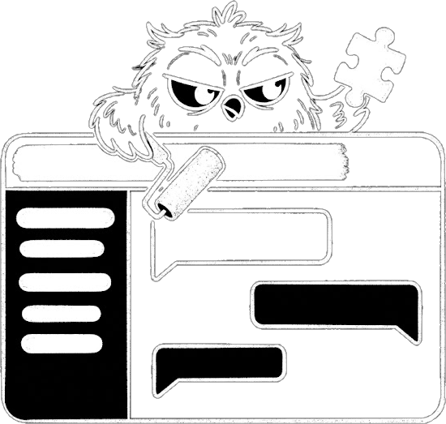

# Omnigent Overlays

<p align="center">
  
</p>

UI overlays for [Omnigent](https://github.com/omnigent-ai/omnigent).

Not a fork, A proxy in front of your Omnigent server to change how things look / function
Basically allows you to customize your experience without needing to manage your own fork

## Install

```sh
curl -fsSL https://raw.githubusercontent.com/nickm8/omnigent-overlays/refs/heads/main/install.sh  | sh
```

Uninstall with `install.sh --uninstall`.

## Overlays

Toggle overlays from the overlay panel inside the app.

## How it works

`manifest.json` is the registry. Each overlay carries a sha256 that is verified before loading
Local state lives in `~/.omnigent-overlays/`.

Writing your own: add a TypeScript file under `src/scripts/`, register it in
`tools/userscript-entries.ts`, and publish.

## Licence

MIT.
